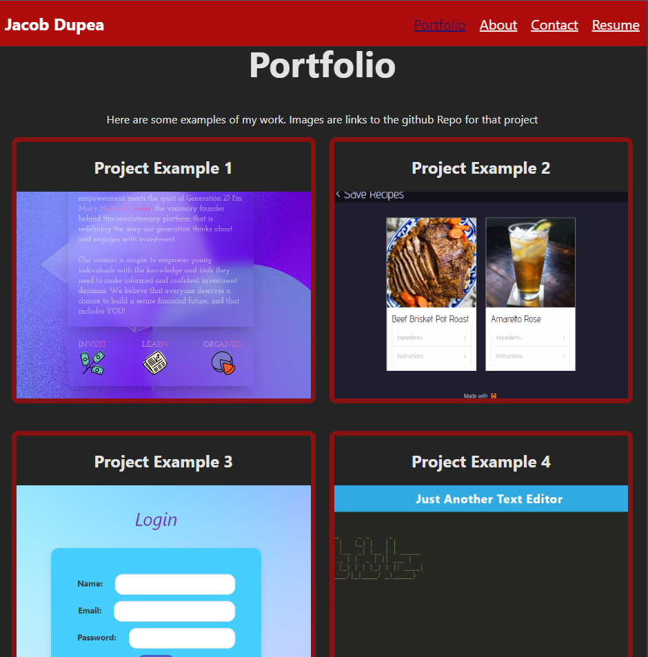

<h1 align="center">Jacobs Portfolio with React</h1> 

<h1 align="center">Deployed at</h1>

 [Netlify Jacobs Portfolio](https://stunning-meringue-9bc01a.netlify.app/)

<h2 align="center">Description</h2>

Here is a remake of my portfolio using React, My site includes projects about me contacts and my resume.

## Table of Contents

- [Usage](#usage)
- [Photos](#photos)
- [License](#license)
- [Features](#features)
- [Contribute](#contribute)
- [Questions](#questions)

## Photos

## Usage

Can be used to view projects and more information about me.

## License

refer to repo for licenses
license is a MIT license.

## Badges

## Features
uses React and npm packages to give look and feel to the portfolio

## Contribute
you can contribute by checking out the live site and testing it for yourself.

## Questions

reach my git hub profile at [profile](https://github.com/DupeaJ).

  
If you have additional questions you can reach me at jacobdupea@gmail.com.
